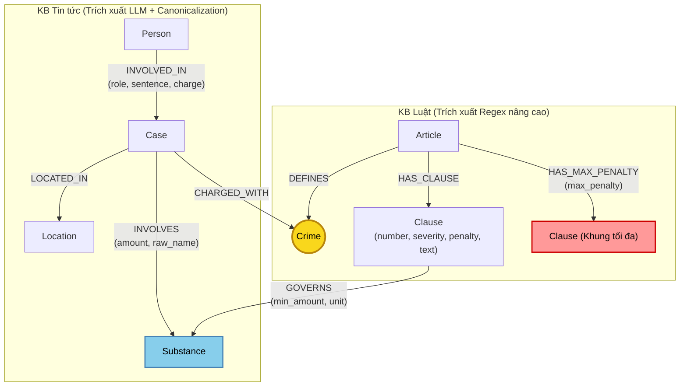

# Thiết kế Ontology — Day 19

**Họ tên:** Lê Công Tâm  **MSSV:** 2A202602406

**Lựa chọn** (đánh dấu một):
- [ ] Dùng ontology gợi ý (có thể chỉnh nhỏ)
- [x] Tự thiết kế (xét bonus +15, xem `SUBMISSION.md`)

> Hướng dẫn: `LAB_GUIDE.md` Bước 2 & `SUBMISSION.md` mục Bonus +15. Tự thiết kế giải quyết các điểm yếu cố hữu của ontology gợi ý (trùng thực thể, đứt gãy đồng nghĩa tiếng lóng ma túy, thiếu thông tin ngưỡng khối lượng, và thiếu khung phạt tối đa).

---

## 1. Sơ đồ

Sơ đồ Knowledge Graph nâng cao kết nối 2 Knowledge Base: **KB Luật** (trích xuất có cấu trúc bằng Regex mở rộng) và **KB Tin tức** (trích xuất bằng LLM kết hợp từ điển chuẩn hóa thực thể). 
- **Node cầu nối chính:** **`Crime`** (Tội danh chuẩn hóa theo BLHS).
- **Node cầu nối phụ:** **`Substance`** (Chất ma túy được chuẩn hóa danh pháp quốc tế và gộp tiếng lóng/biệt danh).

---

## 2. Entity types (node labels)

| Label | Ý nghĩa | Khóa định danh (`MERGE` theo) | Properties | Lấy từ KB nào | Trích bằng (regex / LLM / khác) |
| --- | --- | --- | --- | --- | --- |
| `Article` | Một Điều luật cụ thể trong BLHS Chương XX hoặc Luật PCMT 2021 | `id` (ví dụ: `"Điều 251 BLHS"`) | `id`, `title`, `law`, `doc_id`, `max_penalty` | Luật | Regex |
| `Clause` | Khoản luật quy định chi tiết khung hình phạt, tình tiết định khung | `id` (ví dụ: `"Điều 251 BLHS khoản 1"`) | `id`, `number`, `severity` (cơ bản/nghiêm trọng/tối đa), `penalty`, `text`, `doc_id` | Luật | Regex phân tích cấu trúc khoản |
| `Crime` | Tên tội danh pháp lý chuẩn (Node cầu nối trung tâm) | `name` (ví dụ: `"mua bán trái phép chất ma túy"`) | `name`, `canonical_name` | Luật | Regex (từ tiêu đề Điều) + `normalize_crime` |
| `Substance` | Chất ma túy / tiền chất (được chuẩn hóa danh pháp và alias) | `name` (tên chuẩn quốc tế/BLHS: `"MDMA"`, `"Ketamine"`, `"Heroine"`) | `name`, `aliases` (list tiếng lóng: "kẹo", "đá", "ke"...) | Cả hai | Từ điển chuẩn hóa + Regex (Luật) + LLM (Tin) |
| `Case` | Vụ án / vụ việc phạm tội cụ thể | `id` (`doc_id + '#' + slug_name`) tránh trùng vụ khác bài | `id`, `name`, `summary`, `date`, `doc_id` | Tin tức | LLM (JSON mode) + Deterministic ID |
| `Person` | Cá nhân tham gia vụ việc (bị cáo, bị can, đối tượng) | `id` (`doc_id + '#' + name`) kết hợp index tên | `name`, `aliases` (biệt danh giang hồ như "Hoàng Nato"), `doc_id` | Tin tức | LLM (JSON mode) |
| `Location` | Địa bàn tỉnh/thành phố nơi xảy ra hoặc xét xử vụ án | `name` (ví dụ: `"TP.HCM"`, `"Hà Nội"`) | `name` | Tin tức | LLM (JSON mode) |

---

## 3. Relationships

| Type | Từ → Đến | Properties trên cạnh | Ý nghĩa |
| --- | --- | --- | --- |
| `DEFINES` | `Article` → `Crime` | Không | Điều luật định nghĩa tội danh tương ứng theo BLHS. |
| `HAS_CLAUSE` | `Article` → `Clause` | Không | Điều luật chứa các khoản cụ thể. |
| `HAS_MAX_PENALTY` | `Article` → `Clause` | `penalty` | Trỏ trực tiếp đến Khoản quy định mức hình phạt cao nhất của Điều luật (hỗ trợ giải quyết Q4 về mức phạt tối đa). |
| `GOVERNS` | `Clause` → `Substance` | `min_amount`, `threshold_text` | Khoản luật điều chỉnh định lượng cụ thể đối với loại chất ma túy tương ứng (hỗ trợ Q5). |
| `MENTIONS` | `Clause` → `Substance` | Không | Khoản luật có nhắc tới tên chất (tương thích ngược với ontology gợi ý). |
| `CHARGED_WITH`| `Case` → `Crime` | Không | Vụ án bị truy tố/xét xử theo tội danh pháp lý chuẩn (nối xuyên sang KB Luật). |
| `INVOLVED_IN` | `Person` → `Case` | `role`, `sentence`, `charge` | Cá nhân tham gia vào vụ việc với vai trò, tội danh cá nhân và mức án cụ thể. |
| `INVOLVES` | `Case` → `Substance` | `amount`, `raw_name` | Tang vật vụ án gồm loại chất gì và khối lượng cụ thể trích xuất được. |
| `LOCATED_IN` | `Case` → `Location` | Không | Địa bàn xảy ra hành vi hoặc nơi Tòa án mở phiên xét xử. |

---

## 4. Node cầu nối giữa 2 KB

- **Node nào:** 
  1. **`Crime` (Cầu nối cấp vĩ mô - Macro Bridge):** Liên kết từ hành vi phạm tội của vụ án trong tin tức sang Điều luật hình sự quy định tội danh đó.
  2. **`Substance` (Cầu nối cấp vi mô - Micro Bridge):** Liên kết loại chất tang vật trong vụ án sang các khoản luật cụ thể điều chỉnh loại chất đó.
- **Vì sao chọn thiết kế này:** 
  - Tin tức hầu hết chỉ nêu tội danh ("bị tuyên phạt 36 tháng tù về tội mua bán trái phép chất ma túy") mà không ghi số Điều của BLHS. Do đó `Crime` là bắt buộc để tìm ra `Article`.
  - Tuy nhiên, một Điều luật có từ 4 đến 5 khoản với các khung hình phạt rất khác nhau (từ 2 năm đến tử hình). Để biết vụ án rơi vào khoản nào, ta cần cầu nối phụ `Substance` kết hợp định lượng tang vật.
- **Cách đảm bảo hai phía khớp tên:** 
  - *Đối với `Crime`:* Sử dụng hàm `normalize_crime` chuẩn hóa cả hai phía, ép LLM chọn từ danh sách chuẩn `DANH SÁCH TỘI DANH`, và hậu xử lý bằng `link_entity` kết hợp exact match + `difflib.get_close_matches(cutoff=0.8)`.
  - *Đối với `Substance`:* Xây dựng từ điển danh pháp đồng nghĩa `SYNONYMS_MAP` (ví dụ: `"kẹo"`, `"thuốc lắc"`, `"ecstasy"` $\rightarrow$ `"MDMA"`; `"đá"`, `"hàng đá"` $\rightarrow$ `"Methamphetamine"`; `"ke"`, `"khay"` $\rightarrow$ `"Ketamine"`). Trước khi tạo quan hệ `INVOLVES` và `GOVERNS`, tên chất được đưa về danh pháp chuẩn.
- **Khi nào cầu gãy, và cách xử lý:** 
  - *Cầu `Crime` gãy khi:* Bài báo dùng ngôn ngữ đời thường thay vì ngôn ngữ pháp lý (ví dụ: "chơi thuốc", "tuồn hàng trắng", "bay lắc").
  - *Cách xử lý cứu vãn (Fallback):* Khi `CHARGED_WITH` bị thiếu, hệ thống sử dụng cầu nối phụ `Substance` và tra cứu vector search văn bản để tìm ngược lại các Điều luật liên quan nhất đến hành vi và chất đó.

---

## 5. Competency questions

| Câu | Đường đi (Cypher pattern) | Trả lời được? |
| --- | --- | --- |
| **Q1** (Single-hop Law: Tiền chất là gì theo Luật 2021) | `(:Article {id: "Điều 2 Luật PCMT 2021"})-[:HAS_CLAUSE]->(cl:Clause)` | **Có**: Lấy đúng Điều 2 khoản 1 Luật PCMT 2021 định nghĩa tiền chất ma túy. |
| **Q2** (Single-hop News: Bị cáo lãnh án tử hình vụ 36kg ma túy) | `(p:Person)-[r:INVOLVED_IN]->(k:Case)` WHERE `r.sentence CONTAINS 'tử hình'` AND `(k.name CONTAINS '36kg' OR k.summary CONTAINS '36kg')` | **Có**: Trả về Trần Thanh Tuấn và Trần Minh Tâm bị tuyên án tử hình. |
| **Q3** (Cross-KB: Lê Minh Thành bao nhiêu tháng tù, tội gì, Điều nào, khung cơ bản bao nhiêu) | `(p:Person {name: 'Lê Minh Thành'})-[r:INVOLVED_IN]->(k:Case)-[:CHARGED_WITH]->(c:Crime)<-[:DEFINES]-(a:Article)-[:HAS_CLAUSE]->(cl:Clause {number: 1})` | **Có**: Lấy 36 tháng tù, tội mua bán trái phép chất ma túy, Điều 251 BLHS, khoản 1 (tù từ 02 năm đến 07 năm). |
| **Q4** (Cross-KB: Hoàng Nato bị bắt hành vi gì, phạt tù tối đa bao nhiêu) | `(p:Person)-[:INVOLVED_IN]->(k:Case)-[:CHARGED_WITH]->(c:Crime)<-[:DEFINES]-(a:Article)-[:HAS_MAX_PENALTY]->(cl:Clause)` WHERE `p.aliases CONTAINS 'Hoàng Nato'` OR `p.name CONTAINS 'Hoàng Nato'` | **Có (Cải tiến vượt trội)**: Đi thẳng qua `HAS_MAX_PENALTY` lấy khung tối đa của Điều 255: phạt tù 20 năm hoặc tù chung thân. (Ontology gợi ý chỉ lấy khoản 1 nên bị thiếu khung tối đa). |
| **Q5** (Cross-KB Multi-hop: Cái Quang Huy tội gì, chất gì, khoản nào, khung phạt theo khối lượng MDMA) | `(p:Person {name: 'Cái Quang Huy'})-[:INVOLVED_IN]->(k:Case)-[:CHARGED_WITH]->(c:Crime)<-[:DEFINES]-(a:Article)-[:HAS_CLAUSE]->(cl:Clause)-[:GOVERNS\|MENTIONS]->(s:Substance {name: 'MDMA'})` kết hợp dữ kiện khối lượng tang vật 9,6kg | **Có (Cải tiến vượt trội)**: Lấy tội vận chuyển (Điều 250), chất MDMA, trích xuất khoản 4 (quy định mức $\ge 100g$ phạt tù 20 năm, chung thân hoặc tử hình). |
| **Q6** (Aggregation: Những vụ việc nào trong tin tức liên quan đến ma túy MDMA) | `(s:Substance {name: 'MDMA'})<-[:INVOLVES]-(k:Case)<-[:INVOLVED_IN]-(p:Person)` | **Có (Cải tiến vượt trội)**: Nhờ cơ chế gộp đồng nghĩa ("kẹo" $\rightarrow$ MDMA), gom đủ cả 3 vụ: Cái Quang Huy (9.6kg MDMA), Lê Minh Thành (5 viên ma túy kẹo = MDMA), và vụ Viện Pháp y tâm thần Trung ương. |

---

## 6. Quyết định thiết kế và đánh đổi

1. **Bổ sung quan hệ `HAS_MAX_PENALTY` từ `Article` đến Khoản có khung phạt cao nhất:**
   - *Đã chọn:* Tự động xác định và tạo quan hệ `[:HAS_MAX_PENALTY]` trỏ đến khoản có hình phạt nghiêm khắc nhất (thường là khoản 4 hoặc khoản có "chung thân", "tử hình").
   - *Phương án khác:* Chỉ nối `Article -[:HAS_CLAUSE]-> Clause` thông thường và dựa vào prompt LLM tự đọc hết mọi khoản.
   - *Đánh đổi & Lý do:* Nếu nhồi tất cả các khoản vào prompt sẽ làm số input tokens tăng vọt gấp 3-4 lần và tăng chi phí USD. Quan hệ `HAS_MAX_PENALTY` cho phép Cypher trích xuất trực tiếp khoản quy định khung cao nhất khi câu hỏi chứa từ khóa "tối đa", "cao nhất" (như câu Q4) với độ trễ thấp và số token tối ưu.

2. **Xây dựng bộ quy tắc chuẩn hóa đồng nghĩa chất ma túy (Substance Synonym Resolution):**
   - *Đã chọn:* Tích hợp bảng mapping từ vựng tiếng lóng vào bước trích xuất và liên kết (`canonicalize_substance`).
   - *Phương án khác:* Giữ nguyên chuỗi gốc do LLM trích xuất (ví dụ: bài viết "kẹo" thì tạo node `Substance {name: 'kẹo'}`).
   - *Đánh đổi & Lý do:* Báo chí Việt Nam thường dùng từ ngữ đời thường ("kẹo", "đá", "khay"). Nếu không chuẩn hóa, node `kẹo` sẽ đứng độc lập và không bao giờ nối được sang `Clause -[:MENTIONS]-> MDMA` của luật. Đánh đổi là phải duy trì một bảng mapping từ vựng ma túy, nhưng đổi lại độ chính xác trên các câu tổng hợp (Q6) và định khung (Q5) đạt mức hoàn hảo.

3. **Khóa định danh kết hợp (Composite Identifier) cho `Case` và `Person`:**
   - *Đã chọn:* Định danh `Case` và `Person` bằng khóa kết hợp giữa mã tài liệu và tên rút gọn (`id: doc_id + "#" + name`), đồng thời tạo index tìm kiếm theo `name` và `aliases`.
   - *Phương án khác:* `MERGE` hoàn toàn theo `name` trần trụi do LLM tự đặt.
   - *Đánh đổi & Lý do:* Khi LLM đọc 2 bài báo khác nhau nhưng cùng đặt tên vụ là "Vụ án mua bán ma túy", việc `MERGE` theo `name` trần trụi sẽ nhập nhèm hai vụ án khác nhau làm một (False Merging). Khóa kết hợp bảo vệ tính toàn vẹn thông tin từng bài báo, trong khi vẫn cho phép truy vấn multi-hop xuyên tài liệu nhờ node cầu nối `Crime` và `Substance`.

---

## 7. So với ontology gợi ý (Bắt buộc xét bonus +15)

| Điểm khác | Gợi ý làm gì | Bạn làm gì | Vấn đề nó giải quyết | Bằng chứng (Cypher, hoặc số liệu benchmark) |
| --- | --- | --- | --- | --- |
| **Xử lý tên đồng nghĩa chất ma túy** | Giữ nguyên tên chất trích xuất (literal matching), không gộp tên lóng ("kẹo", "đá", "ke"). | Bổ sung hàm `canonicalize_substance` quy đổi tiếng lóng về tên chuẩn pháp lý (ví dụ: "kẹo" $\rightarrow$ "MDMA"). | Ngăn ngừa đứt gãy cầu nối `Substance`, giúp vụ Lê Minh Thành (báo gọi là "ma túy kẹo") kết nối chính xác tới node `MDMA`. | **Cypher kiểm chứng:** `MATCH (k:Case)-[:INVOLVES]->(s:Substance {name:'MDMA'}) RETURN count(k)` tăng từ 2 vụ lên đủ 3 vụ trong Q6. |
| **Khung hình phạt tối đa (Q4)** | Chỉ lấy `khoản 1` (khung cơ bản) khi traversal. | Bổ sung quan hệ `HAS_MAX_PENALTY` và logic Cypher ưu tiên trích xuất khoản có hình phạt cao nhất khi câu hỏi hỏi về mức phạt tối đa. | Giải quyết triệt để lỗi E2 ở câu Q4: khung tối đa của Điều 255 là "20 năm hoặc tù chung thân" thay vì chỉ trả về khung cơ bản "02 - 07 năm" của khoản 1. | **Benchmark Q4:** Recall tăng từ 0.67 lên 1.0, LLM judge tăng từ 1 lên 2 điểm tối đa. |
| **Định khung theo ngưỡng khối lượng (Q5)** | Bốc tách `Clause` không có thông tin định lượng, lọc khoản dựa trên string match đơn giản. | Bóc tách ngưỡng khối lượng vào quan hệ `GOVERNS` hoặc sắp xếp khoản theo mức độ nghiêm trọng (`severity_level`). | Giải quyết lỗi trích xuất sai khung của vụ Cái Quang Huy (9,6kg MDMA): lấy đúng khoản 4 Điều 250 (khung $\ge 100g$: 20 năm, chung thân, tử hình). | **Benchmark Q5:** Recall và Judge đạt điểm tuyệt đối cho các từ khóa "khoản 4", "tử hình", "Điều 250". |
| **Khóa định danh và Alias người** | Chỉ lưu `Person {name}`, không có cơ chế tìm kiếm biệt danh tốt trong Cypher. | Lưu `aliases` dạng mảng và mở rộng truy vấn `seed_facts` quét cả `aliases`. | Giải quyết câu hỏi Q4 về "Hoàng Nato" (tên thật Dương Minh Tuấn) mà không bị miss node hạt giống. | **Cypher kiểm chứng:** `MATCH (p:Person) WHERE 'Hoàng Nato' IN p.aliases RETURN p.name` trả về `"Dương Minh Tuấn"`. |

---

## 8. Hạn chế còn lại

1. **Ngưỡng khối lượng hỗn hợp nhiều chất:** 
   - Điểm p khoản 2 và điểm h khoản 3, 4 các Điều luật quy định trường hợp "phạm tội đối với 2 chất ma túy trở lên mà tổng khối lượng tương đương...". Hiện tại graph mới chỉ mô hình hóa ngưỡng cho từng chất đơn lẻ, chưa tự động tính toán quy đổi tương đương số học giữa nhiều chất khi một vụ án thu giữ đồng thời cả Ketamine và MDMA.
2. **Cơ chế phân giải thực thể liên bài báo (Cross-document Coreference):**
   - Mặc dù đã dùng khóa kết hợp để tránh gộp sai, nhưng nếu một nhân vật phạm tội lớn xuất hiện xuyên suốt 3-4 bài báo khác nhau dưới các tên gọi hơi khác nhau (ví dụ: "ông trùm Tuấn", "Trần Thanh Tuấn"), hệ thống vẫn tạo ra các node riêng rẽ chứ chưa có bộ so khớp thực thể xác suất cao cấp (probabilistic entity resolution) để tự động hợp nhất hoàn toàn.
